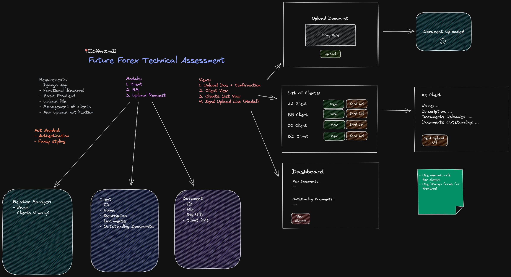

# Future Forex Assessment
This is a Django management app that allows Relationship Managers to easily maintain
and organise their clients' documentation.


## Overview

## Project Timeline
**Start Date:** Wednesday, 09 February 2022 <br>
**End Date:** Friday, 11 February 2022

## Technologies Used
- Django / Python
- Basic HTML and CSS
- PyCharm IDE

## Approach Taken


## Getting started
- You would need to set up a python environment
- Currently the database already has some dummy data
- It is using the first RelationalManager as the one 'logged in'

## Wins and Blockers
### Wins
I already have some good experience with Django and quickly setting up a html frontend.

### Blockers
Had to quickly remember how to set up a Django app from the start, as I've been working on much bigger code bases
for a while now.

## Visuals and Featured Code
Added email capabilities
```python
send_mail(
    subject='Document Request',
    message=message,
    html_message=message,
    from_email='brigitte.sprung.dev@gmail.com',
    recipient_list=[email],
    fail_silently=False,
)
```